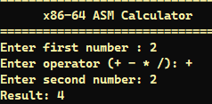

# x86-64 Assembly Calculator

A modular, 64-bit x86 assembly calculator built using NASM syntax for the Windows x64 architecture. This project demonstrates low-level arithmetic logic, manual register allocation, adherence to the Windows x64 ABI calling convention, and interoperability with standard C library I/O functions (`printf` and `scanf`).

---

## Preview / Screenshot



---

## Features

- **Core Arithmetic Operations:** Supports addition, subtraction, signed multiplication, and signed division.
- **Error Handling:** Built-in validation for division-by-zero errors and unrecognized operator inputs.
- **Modular Architecture:** Clean separation between mathematical routines, preprocessor definitions, and the main control flow.
- **Windows x64 ABI Compliance:** Implements 32-byte shadow space allocation and register-based argument passing (`RCX`, `RDX`, `R8`).

---

## Project Structure

| File | Description |
| :--- | :--- |
| `main.asm` | Main entry point handling console user input via `scanf`, operator branching, and formatted printing via `printf`. |
| `calculator.asm` | Exported assembly procedures for arithmetic routines (`add_numbers`, `sub_numbers`, `mul_numbers`, `div_numbers`). |
| `calculator.inc` | Include file defining macro constants for arithmetic operators. |

---

## Prerequisites

- **Assembler:** [NASM (Netwide Assembler)](https://www.nasm.us/) 64-bit
- **Compiler / Linker:** GCC (via MinGW-w64) or MSVC (`link.exe`) to link against the C runtime library.
- **Operating System:** Windows (x64)

---

## Building and Running

### Using GCC (MinGW-w64)

1. **Assemble the source files into 64-bit object files:**
   ```bash
   nasm -f win64 main.asm -o main.obj
   nasm -f win64 calculator.asm -o calculator.obj
